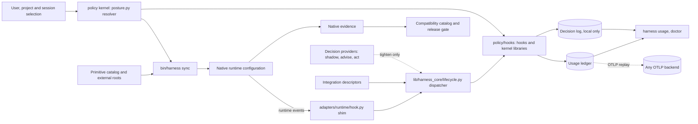
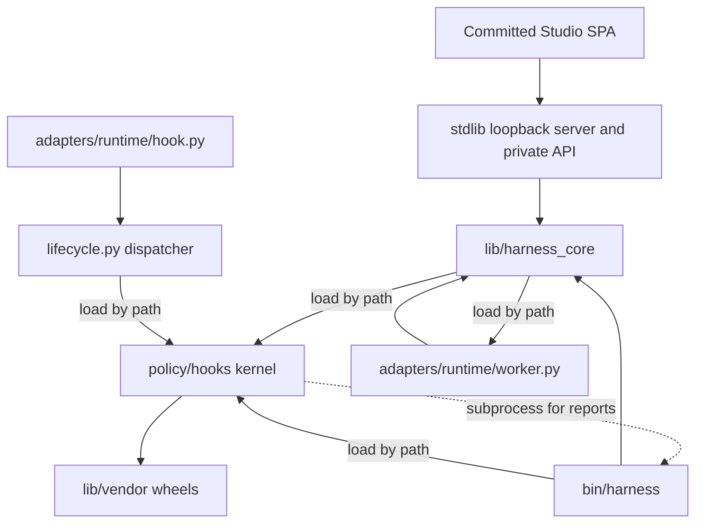
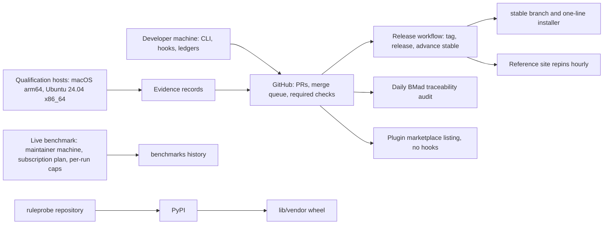

> Current delivery assignments: [Delivery annotations — 2026-09-28](../../roadmap-2026-09-28.md). Earlier dates below remain historical.

# Architecture Spine: Model Citizen

## Design Paradigm

The harness is a **policy kernel with ports and adapters**, and two ports carry its authority:
- The **projection port.** `harness sync` writes resolved policy into each runtime's native configuration.
- The **hook port.** Runtime events call one dispatcher, which runs the policy hooks. The hooks enforce
  the same resolved policy at the moment of action.

Everything observed lands in local ledgers, and every report reads from them. External
frameworks and decision providers are guests at the hook port and never own a decision.

The planned Studio adds a second face over the same core. Its committed browser bundle calls a private,
launcher-bound loopback server; that server and `bin/harness` call the same core functions. The browser
bundle, server and store are planned for v0.18.0, not implemented or validated here.

The layers, as the code has them:
- **Policy kernel: `policy/hooks/`.**
  - Standalone, standard-library, import-cheap modules.
  - Hooks run as separate processes, so shared hook code sits beside the hooks and is loaded by file path.
  - `posture.py` is the one resolver of the stance ladder and the model ladder.
  - `pricing.py`, `telemetry.py` and `decisions.py` are kernel libraries, not hooks.
  - The kernel imports nothing above its own directory.
- **Hook dispatch: `lib/harness_core/lifecycle.py`.**
  - The event table per runtime and the tool-name aliases.
  - Composition of hook answers, including per-runtime translation. For example, it turns an `ask` into a
    `deny` on Codex.
  - It loads kernel modules by path.
  - `adapters/<runtime>/hook.py` is an eight-line shim into this dispatcher.
- **Core library: `lib/harness_core/`.**
  - Catalog, compatibility and qualification.
  - Workers, integrations, decisions, reconcile, tasks, keychain and remote control.
  - It loads kernel modules and `adapters/<runtime>/worker.py` by path.
- **CLI: `bin/harness`.**
  - The command layer: configuration loading, sync, worktrees, workspaces and the reports.
  - Today it also holds a second precedence ladder (`load_config`), which AD-2 retires.
- **Adapters: `adapters/<runtime>/`.**
  - `bindings.json`, `capabilities.json`, the hook shim, and `worker.py` for launching workers.
  - A worker may import core helpers.
- **Sources and projections.**
  - `primitives/` is the primitive catalog.
  - `claude/` links into `primitives/` and `policy/hooks/`, beside two hand-authored sources:
    `settings.template.json` and `OWNERSHIP.json`.
  - `codex/` and `vscode/` hold native settings and examples.



## Invariants & Rules

Dependency direction is a rule:
- The kernel imports nothing above itself. Its one outward reach is `lib/vendor/`, a leaf.
- The dispatcher, the core library and the CLI load kernel modules by path.
- The CLI uses the core library, and a worker may import core helpers.
- The session hook calls the CLI as a subprocess for reports (`stances --json`, `diff`, `integration
  check`, `task show`). Those command outputs are contracts, and the resolver migration in AD-2 keeps
  them.

Nothing outside the kernel resolves stances or models.



### AD-1: Shared primitive authority [ADOPTED]

- **Binds:** FR-1, FR-3, FR-10, FR-13, FR-42, FR-43, FR-68; the rules, skills, roles, workflows, stance
  definitions and adapter inputs.
- **Prevents:** runtime-specific policy catalogs becoming competing sources of truth.
- **Rule:**
  - Author shared meaning once. Adapters may translate it but never redefine it.
  - Workflow text stays runtime-neutral, so that Codex can project workflows as skills.
  - A capability a runtime lacks is declared in its `capabilities.json` and is never emulated by a
    second copy of the primitive.
    - The capability modes are `instruction`, `instruction-and-hook` and `instruction-and-setting`.
    - The tier restriction is `enforced`, `advisory` or `none`.

### AD-2: One resolver, fixed invariants [ADOPTED for invariants; resolver unification in progress]

- **Binds:** FR-2, FR-14, FR-15, FR-16; stance selection, the selection model, modes and switches.
- **Prevents:**
  - a switch disabling truthfulness, authorization, secret protection or a native restriction;
  - two precedence ladders disagreeing, which #294 records today.
- **Rule:**
  - `policy/hooks/posture.py` is the only resolver. Its precedence runs from the defaults, through the
    user and project layers, to the session.
  - Project configuration may select stances only.
    *Amended 2026-09-25:* a project file now carries the whole selection document, so it may also
    switch rules, hooks, skills, workflows and roles and name a mode (#554). Identity, permissions,
    runtime flags, `primitive_roots` and telemetry stay user-owned, and a project file that sets one
    is refused with a message naming the key. Invariants still sit outside every switch.
  - `bin/harness` stops resolving on its own and calls the resolver. #294 and #554 carry that
    migration, and no new code may read the ladder directly. The session hook reports stances through
    `bin/harness stances --json`, so that output keeps its shape across the migration.
  - Core hooks can be switched off only behind an explicit acknowledgement.
  - For modes, a developer's explicit choice shadows a mode key, while a value `harness init` wrote as a
    default does not. The resolver must therefore be able to tell the two apart. #557 picks the
    mechanism within that constraint.
    *Amended 2026-09-25, confirmed by the owner on 2026-09-25:* per #557, `config.json` records the
    stances `harness init` wrote as defaults, each with the value it wrote, under
    `init_defaults: {"stances": {name: value}}`, and each one still holding its recorded value
    resolves in a new `init` layer between the defaults and the mode. `harness init --yes` and
    a `config set` that creates the file mark every stance, interactive init marks only the answers
    Enter accepted, and `harness config set stances.NAME` or a hand edit of the value makes that
    stance typed again. A config written before this change has no
    `init_defaults`, so every stance in it stays typed and shadows a mode. This adds a key to the
    user config schema and a layer to the precedence.
  - Invariants sit outside every switch.

### AD-3: Reversible configuration ownership [ADOPTED]

- **Binds:** FR-4, FR-5, FR-17, FR-66, FR-69, FR-70; install, sync, drift handling, upgrade, uninstall.
- **Prevents:** silent loss of user-owned settings, and unsafe restoration after a user edit.
- **Rule:**
  - Edit only declared fields, structurally.
  - Record prior and applied values.
  - Restore only while the current value still matches what the harness applied.
  - Only one sync runs at a time, holding the `sync.lock` in `reconcile.py`.
  - Compare semantically for rollback, never by byte snapshot.

### AD-4: Evidence-backed compatibility [ADOPTED]

- **Binds:** FR-6, FR-7, FR-12, FR-51, FR-52, FR-53; catalog entries, native evidence, public summaries and
  release gates.
- **Prevents:**
  - tests of projections being presented as native support;
  - unrelated merges invalidating evidence.
- **Rule:**
  - Every supported target references passing evidence for the exact source revision. A contradictory
    active failure blocks the claim.
  - `SOURCE_PATHS` in `lib/harness_core/compatibility.py` is the one authority on which paths invalidate
    evidence.
  - Invalidation is scoped per runtime, through the catalog's `evidence_invalidation`:
    - only `hook.py` is private to a runtime, so a change there invalidates that runtime's targets
      together;
    - a change to `bindings.json`, `capabilities.json` or `worker.py` under either adapter invalidates
      every target, because shared code reads them for every runtime;
    - so does a change to any other shared source path.
  - Within a target, invalidation is per case, through the catalog's versioned `case_paths` map: a change
    under a path a case names makes that case stale, a change under a path no case names invalidates the
    whole record, and a record that states no map, or another map, keeps the whole-target rule (#582).
  - The catalog states are `qualified`, `unqualified`, `planned` and `unsupported`.
  - A round runs frozen on a release branch. A model-free smoke tier runs before any native case.
  - Every public surface reads its version and status from the catalog and `product.json`. The plugin
    manifests still hard-code a version, which is a migration tracked with the plugin follow-up.

### AD-5: Public planning with the design in the story file [ADOPTED; the tool contract merged in #629]

- **Binds:** FR-9, FR-64, FR-65; BMad artifacts, typed IDs, GitHub issues, PR ownership, the sync tool.
- **Prevents:**
  - private planning state being necessary to understand a public change;
  - the sync tool overwriting human-authored design.
- **Rule:**
  - GitHub owns delivery state, discussion, the summary and acceptance evidence. The story file owns the
    design.
  - The sync tool owns only the frontmatter, the H1 and the managed block. Everything after the block is
    preserved byte for byte.
  - A legacy stub is recognised positively. Any other file without a well-formed block is refused.

### AD-6: One effective policy for every consumer [PARTIAL: the CLI's ladder retires under AD-2]

- **Binds:** FR-2, FR-27, FR-32, FR-68; hooks, rendered files, telemetry, workers and the output style.
- **Prevents:** a component acting on a variant other than the one the resolver chose. An audit found
  this in a hook, in the output style and in telemetry.
- **Rule:**
  - Every consumer asks `posture.py` for the effective policy.
  - No component parses selection files itself.

### AD-7: What a hook may and may not do [ADOPTED]

- **Binds:** FR-30 to FR-32, FR-35 to FR-39, FR-41, FR-48; every enforcement mechanism.
- **Prevents:** designs that depend on runtime powers that do not exist.
- **Rule:**
  - Enforcement may rely on:
    - pre-tool deny, ask or input rewrite, wherever the runtime supports each;
    - a stop-event block;
    - post-tool and session context notices;
    - role workers;
    - the local ledgers.
  - No design may replace a built-in tool's result or trigger compaction from a hook.
  - The event table in `lifecycle.py` is the one declaration of which events each runtime raises. It
    changes only after a probe on the named client version.
  - A gap is declared in `capabilities.json`, never papered over.

### AD-8: Constrained roles run only as isolated role workers [ADOPTED; two unguarded paths named]

- **Binds:** FR-40, FR-41, FR-42; the gatherer, planner, reviewer and spec-reviewer, and every spawn path.
- **Prevents:**
  - a native subagent inheriting its parent's permissions;
  - a worker that both reads a workspace and fetches the web.
- **Rule:**
  - Constrained roles run as separate processes, with restricted tools, declared input roots, deadlines
    and private logs.
  - The gatherer runs offline.
  - The harness publishes a planner's output to a new path.
  - Every spawn path is guarded or declared unguarded. Two paths are named gaps:
    - the Workflow tool's `agent()` (#576);
    - the plugin channel, which installs constrained roles as native agents with no hook (the plugin
      follow-up under #634).
    *Amended 2026-09-25:* the Workflow tool's launch is guarded (#576): the pre-tool hook reads the script
    and refuses one naming a constrained role, so the remaining gap there is band routing of its
    `agent()` calls, not confinement.

### AD-9: Checks bind subagents; decisions flow up [ADOPTED]

- **Binds:** FR-33; every gate, approval and governance check.
- **Prevents:** a subagent asking the user directly, or skipping a check its orchestrator is bound by.
- **Rule:**
  - A check that binds a session binds its subagents.
  - Each level decides what it can and returns the rest as pending.
  - Only the top session asks the user.

### AD-10: Integrations are descriptors bound at the hook port [ADOPTED for BMad; the viewer migrates]

- **Binds:** FR-45, FR-46; BMad, and every new framework.
- **Prevents:**
  - bespoke CLI code for each framework;
  - confinement that depends on prompt text a runtime may paraphrase.
- **Rule:**
  - A framework emits intents only.
  - A new integration is a data descriptor in `policy/integrations/`. It states the framework, the
    version pin, how its spawns are recognised, the role mapping and the input roots.
  - Confinement keys on the descriptor's mapping and a session-level signal.
  - The architecture viewer predates the contract (it lives in `lib/harness_core/upstream_viewer.py`
    and `integrations/architecture-viewer/`). It moves to a descriptor when its mailbox adapter lands.

### AD-11: Local ledgers are the system of record, and grow compatibly [ADOPTED]

- **Binds:** FR-11, FR-23 to FR-27, FR-66; usage, pricing, the decision log, export.
- **Prevents:**
  - history lost to backend retention or transcript expiry;
  - an export failure blocking an agent;
  - an upgrade leaving old rows unreadable.
- **Rule:**
  - Hooks append rows with a locked or `O_APPEND` single write.
  - The only rewrite of a ledger is the usage worker's `upsert`, which runs under the ledger lock through a
    temporary file and an atomic replace, so no row is lost.
  - The decision log is append-only, and it is never exported.
  - A backend is a replica, rebuilt by replay.
  - Export is OTLP only, off by default, standard library only, and never blocks a hook.
  - Its settings live in the `telemetry` block, never in a stance.
  - Codex native export stays unauthenticated-only until Codex offers header indirection.
  - Schema changes are additive:
    - rows carry a schema version from the next ledger change on;
    - readers tolerate unknown fields;
    - a rename ships with a fold map, as renamed detector ids already do.

### AD-12: Measurement invariants [ADOPTED; estimand labels planned for v0.14.0, soft-estimate report for v0.15.0]

- **Binds:** FR-24, FR-55 to FR-58; the benchmark runner, pricing, usage reports and published evidence.
- **Prevents:** comparisons contaminated by model drift, profile leakage or double counting; a modelled
  estimate read as a measurement.
- **Rule:**
  - Compare ratios across days, never dollars. Dollars are list-price equivalents.
  - Arms differ only by environment. Each fence is proved before scoring, and no tagged sync touches a
    live profile.
  - Unknown and unpriced values are never zero. An errored run is never a failure.
  - A session row is never summed with its subagent rows. A subagent's cost comes from its own
    transcript.
  - Micro-tier rows never enter the production series.
  - Every row records the provenance of its arm. Ablations are declared in an ablation manifest, which
    lists arms and is distinct from a module's manifest (AD-22).
    (Note 2026-09-29, #754: ablation manifests live in `benchmarks/ablations/`, schema 1. A one-policy
    pair names one tag, one session-scoped factor and its reference and treatment values; the bare arm
    runs beside it. No rule changes.)
  - A prefix figure is the first call's whole prompt, every input field summed; a cache write alone is
    never a prefix figure. (Amended 2026-10-01, #514.)
  - Every figure carries an estimand label. (Amended 2026-09-24. The labels land in v0.14.0 with
    attribution; the soft-estimate report and series land in v0.15.0.)
    - **Measured:** a count read directly from recorded rows, or an estimate from runs. Each names the
      fingerprint it covers; an estimate also carries n and an interval.
    - **Unattributed:** a qualifier on a figure from rows with no fingerprint. It supports only
      whole-profile statements.
    - **Soft estimate:** it depends on an assumption the run does not observe, such as the user following
      advice, and a named estimator computes it.
    - **Unmeasured:** there is no instrument.
  - The soft series is never pooled with the measured one.
  - Estimand labels are orthogonal to FR-11's known, partial, unavailable and failed, which describe a
    field's availability. Both apply to a figure.

### AD-13: Detector logic lives in `ruleprobe` [ADOPTED; declarative loading in the harness planned]

- **Binds:** FR-19 to FR-22, FR-67; the detector registry, lint and usage reports.
- **Prevents:** the harness and the standalone instrument disagreeing about whether a rule fired.
- **Rule:**
  - The harness binds rules to detectors, and vendors a pinned `ruleprobe` wheel that it never forks.
  - A `ruleprobe` release means a harness version bump.
  - Declarative detectors are data. `ruleprobe` reads them today. When the harness loads them (planned),
    it reads them through the same engine.

### AD-14: For cost, hooks only route and refuse frontier [ADOPTED]

- **Binds:** FR-28 to FR-34; postures, capability classes, band workers and briefs.
- **Prevents:** spend caps that cripple long tasks, and roles hard-wired to model names.
- **Rule:**
  - For cost, hooks enforce exactly two things:
    - routing unnamed spawns to the posture's default band;
    - refusing an undeclared `frontier` request.
  - Budgets, feeds and nudges are information. No hook denies for cost.
  - Roles name capability classes, and adapter bindings name models.

### AD-15: Decision providers are subordinate [ADOPTED for the contract; act consumers planned]

- **Binds:** FR-47 to FR-50; every decision point and provider.
- **Prevents:** a judge relaxing a guardrail; a stale threshold acting on a changed model; an `act`
  stage becoming a deny on a runtime that cannot ask.
- **Rule:**
  - The deterministic answer is authoritative. A provider advances a stage only by its written
    criterion.
  - At `act`, a provider may only tighten:
    - at a pre-tool point, an allow becomes an ask;
    - at the stop point, an allowed stop becomes a block that returns the turn to the agent with the
      provider's reason.

    It never denies a tool call, and it never releases a block.
  - Wherever an `ask` would not reach the user, a pre-tool point cannot use `act` and stays at `advise`.
    That covers Codex, which turns an ask into a deny, and Claude Code under `auto` or `bypass`, which
    ignore an ask.
  - Every error or timeout fails open to the deterministic answer.
  - Thresholds are keyed to the pinned model id and the question-pack version.
  - The egress allowlist is empty by default.
  - No model trains on a third-party provider's output.
  - Evidence changes a stance only as a proposal the developer applies.

### AD-16: Parallel writers coordinate through shared, recorded state [PARTIAL: claims and the pre-write check in v0.14.0 (#542); archive planned (#543)]

- **Binds:** FR-44, FR-63; builders, worktrees, the decision log, the session archive.
- **Prevents:** overlapping edits between sibling agents, and coordination chat that bills as prompts.
- **Rule:**
  - Parallel writers declare their paths, including new ones.
  - Every overlap is logged where the runtime has a pre-write hook. Elsewhere, the adapter declares the
    gap.
  - Whether an overlap warns or denies is a policy variant.
  - There is no peer messaging. Archive recall is pull-only.

### AD-17: Behaviour read from client internals is pinned and checked [PARTIAL: pin planned under #636]

- **Binds:** FR-60, FR-30, FR-41; Remote Control hosts and the Workflow tool guard.
- **Prevents:** a runtime update silently breaking a feature built on undocumented client behaviour.
- **Rule:**
  - Behaviour learned by reading client internals is pinned to the client versions it was verified on,
    and `doctor` warns when the running client is outside them.
  - Such features stay outside the v1 stable surface.
  - Today `lib/harness_core/remote_control.py` names its versions only in comments. The pin and the
    doctor check are the migration.

### AD-18: Shared-machine concurrency and writes [PARTIAL: helper and per-session counter planned]

- **Binds:** FR-9, FR-36, FR-38, FR-44, FR-59, FR-62; every writer on a machine running many sessions.
- **Prevents:** sessions corrupting each other's state, one session's scratch reddening every gate,
  duplicate IDs, and half-written files.
- **Rule:**
  - State that belongs to a session is keyed per session. The stop gate's release counter, which is
    kept per checkout today, migrates to this.
  - A whole-file rewrite goes through one shared helper that writes a temporary file, fsyncs it, replaces
    atomically and keeps the mode. This covers configuration, the ownership journal, the issue map, story
    files, benchmark history and kernel state files.
    - The helper lives in the kernel, so kernel writers can load it by path too.
    - The writers in `bin/harness`, `reconcile.py`, `cost_bench.py`, `posture.py`, `stop-gate.py`,
      `usage-feed.py` and `usage-log.py` converge on it (#636).
    - The sync tool already writes this way (#629).
  - A batch rewrite, such as sync across runtimes or `upgrade`, restores what it already wrote when a later
    write fails.
  - Ledgers follow AD-11.
  - ID reservation surveys every reachable issue map.
  - Untracked scratch is never linted as tracked content.
  - Every runtime launched under a substituted HOME gets a throwaway keychain, or fails closed. Workers use
    `harness_core.keychain`. The native acceptance driver has its own implementation, which also fails
    closed, and converges on the module.
  - The live checkout carries only merged content.

### AD-19: Distribution channels carry no second authority [PARTIAL: plugin manifest version]

- **Binds:** FR-17, FR-18, FR-53, FR-54.
- **Prevents:**
  - plugin hooks double-firing with user hooks;
  - release surfaces disagreeing about version or status.
- **Rule:**
  - The plugin carries no hooks, and enforcement needs `harness sync`.
  - The installer installs from `stable`, which only fast-forwards to release tags.
  - Landing, README and About copy come from `product.json` only.

### AD-20: Continuity never moves authority [ADOPTED]

- **Binds:** FR-8, FR-59, FR-61; task handoff, close-out and workspaces.
- **Prevents:** an approval or a verification claim crossing a session or runtime boundary.
- **Rule:**
  - Task state is neutral and non-authoritative.
  - A changed shared plan invalidates prior verification.
  - Approvals never transfer.
  - A workspace shares history by pointing its folders' project keys at one store, and never merges an
    existing store.
  - The `.code-workspace` files are the only workspace map, derived on every call and never stored.
  - One SessionStart hook with its own entry supplies the member instructions the runtime does not load,
    never a member it loaded natively, and never blocks a session.

### AD-21: Dependencies [ADOPTED]

- **Binds:** all.
- **Prevents:** an unreviewed dependency entering a tool that installs into developers' runtimes.
- **Rule:**
  - Use the standard library first, on a Python 3.9 floor.
  - Third-party code enters only as a pinned wheel in `lib/vendor/`, loaded by path, after a licensing
    review. There are no package-manager dependencies at runtime.
  - *Amended 2026-09-27 for the planned Studio:* browser code is the build-time exception. Reviewed npm
    source and its committed browser bundle may enter with an exact lockfile and `third-party.json`;
    every required license text and notice is preserved in the distributed artifact. Node and npm remain
    contributor-only build tools and are absent at runtime. No Studio release ships unless CI builds from
    that lockfile, verifies the committed bundle against its reviewed source and verifies that the shipped
    notices and license texts cover the lockfile. AH-SP017 (#963) proved byte-identical rebuilds across
    three macOS arm64 and three Linux x64 runs, so CI rebuild-and-compare is the selected blocking
    mechanism. This exception does not weaken the standard-library Python 3.9 runtime rule.

### AD-22: Modules declare a manifest [PLANNED: fields and checks v0.14.0, #554; scorecard v0.15.0, #514; slots and adapters v0.16.0]

- **Binds:** FR-15, FR-16, FR-19, FR-58; every switchable module, the selection document and the
  scorecard.
- **Prevents:** a module reported as working with nothing measuring it; two modules taking one slot
  unnoticed; results from one profile read as another's; a second resolver.
- **Rule:**
  - Every module declares a manifest with six fields: claims, surface, instruments, slot, dependencies and
    conflicts.
  - Each manifest sits beside its module's source: primitives in the catalog (AD-1), hooks in
    `policy/hooks/`. The one resolver, `policy/hooks/posture.py` (AD-2, AD-6), reads both and resolves
    dependencies and conflicts.
  - A conflict never switches off a fixed invariant. It switches off a core hook only with AD-2's
    acknowledgement.
  - Two switched-on modules claiming one slot is a resolution error, unless one of them declares that it
    cedes the slot.
  - A module with no instrument reports as unmeasured, never as working.
  - The profile fingerprint is a digest of the resolved selection:
    - each switched-on module, with its version or content digest;
    - the stance variants;
    - the configuration values that reach the model or the hooks;
    - the harness version.

### AD-23: Observation adds nothing to any arm's model context, and every new row is attributable [PARTIAL: opt-in registration #867 remains]

- **Binds:** FR-11, FR-23, FR-27, FR-56, FR-58; the observation layer, the ledgers, the decision log and
  every benchmark arm.
- **Prevents:** a baseline observed differently from the arm it is compared against; observation changing
  what it measures; a cost or a decision that no module owns.
- **Rule:**
  - Observation runs in every arm, bare included, through an observation-only hook path. That path appends
    to the ledger, prints nothing, adds no context and returns no decision.
  - **Registration:** observation has its own registered hook entry point beside `hook.py`, and is not
    routed through the dispatcher. It reads which events each runtime raises from the same event table
    AD-7 names as the one declaration, so the two entry points cannot disagree on events.
    *Amended 2026-09-25, confirmed by the owner on 2026-09-25:* #791 ships the entry point, its registration
    built from that table and the bare arm's install, but `harness sync` does not yet register it beside
    `hook.py`. Registering it would start a second process on every hook event for every user, make Codex
    users re-trust their hooks, and break tests that assume one entry per event. A follow-up issue adds
    opt-in registration; until then only `bare_install` writes it, and nothing outside the tests calls that.
  - **Failure:** it fails open and silent. On any exception it exits 0 with no output, never a deny, a
    block or a `systemMessage`. The error goes to a local error log only.
  - In the bare arm, only the observation-only path is installed.
  - Context-emitting handlers, such as `neutralize-tool-output`, the `harness-session` notices and
    `stop-gate`, are enforcement or advisory modules, never observation. Observation never rides on them.
  - A test drives a scripted session against a recorded model through every hook event the arm installs:
    session start, prompt submit, pre and post tool use, subagent stop, and stop. It compares every model
    request with observation on and off. Each must be byte-identical after timestamps and session ids are
    normalised. It runs per arm: bare, and each harness profile under test.
  - Every new ledger row carries the profile fingerprint (AD-22). The fields are additive under AD-11, and
    older rows read as unattributed.
  - Usage rows carry per-module attribution of context tokens. That attribution is an estimate and carries
    AD-12's soft-estimate label.
  - Decision-log rows carry the attribution of hook decisions, not token counts.
  - Adherence events are observation, not instruction.

### AD-24: The brand is Model Citizen; stable identifiers keep agent-harness [PLANNED: v0.14.0, #875]

- **Binds:** FR-9, FR-17, FR-18, FR-25, FR-53, FR-54, FR-66; the CLI name, the plugin ID, living copy,
  on-disk state, planning IDs and telemetry.
- **Prevents:** an install, uninstall or reconcile that can no longer find what it wrote; a dashboard that
  stops matching; planning anchors and dated records rewritten by a rename; a user whose `harness` command
  or plugin stops working without notice.
- **Rule:**
  - The product's name in living copy and public addresses is Model Citizen, and its slug is
    `model-citizen`.
  - `citizen` is the command, and `harness` stays a supported alias with no deprecation. `bin/harness`
    stays the real file, because hooks and the installer locate the checkout by that path; `bin/citizen`
    points at it. Removing `harness` needs a major under the compatibility policy.
  - The plugin ID is `model-citizen@model-citizen`. Doctor recognizes `agent-harness@agent-harness` too,
    and warns when both are enabled.
  - These keep `agent-harness`: on-disk names (`~/.config/agent-harness`, `.agent-harness/`,
    `~/.local/state/agent-harness/`, launchd labels, install markers and managed blocks), the `AH-` IDs,
    the issue map's slug, the planning directory names, telemetry's `service.name`, and every dated record.
    Renaming any of them needs an automatic, reversible migration or a major with notice.
  - The lower-case category noun "agent harness" is not the brand, and stays.

### AD-25: One core, two faces [PLANNED: v0.18.0, #955, #998]

- **Binds:** FR-75, FR-77 to FR-84; the CLI, Studio HTTP handlers and bundled UI.
- **Prevents:** the CLI and Studio resolving, validating, mutating or interpreting evidence differently;
  a domain action available only through the private browser API.
- **Rule:**
  - The core owns one command/query/result DTO contract and one error, revision, idempotency and status
    schema. CLI and Studio routes adapt transports to that contract; no handler or UI reimplements
    resolution, validation, writes or evidence semantics.
  - One owned route registry and schema enumerates every Studio route. Only transport, bootstrap, static
    asset, authenticated health and SSE routes are exempt from CLI parity; they remain registered,
    schema-bound and tested. Every domain query, composition and mutation maps to and displays its exact
    `citizen` equivalent, and tests reject an unregistered route or any other parity exemption.
- **Rejected:** a Studio-specific service layer that duplicates CLI or core domain logic; a private API
  domain action with no CLI equivalent; separate CLI and HTTP payload or error contracts.

### AD-26: Standard-library loopback server and SSE [PLANNED: v0.18.0, #964]

- **Binds:** FR-75, FR-77, FR-80; server lifecycle, request-response routes and live streams.
- **Prevents:** a runtime package manager or platform-specific Python dependency entering the install; a
  second Node implementation of the core.
- **Rule:**
  - The Studio server is Python 3.9 standard-library threaded `http.server`, bound to loopback, with JSON
    request-response and server-sent event streams. Node is contributor-only and no new Python runtime
    dependency enters.
  - One mutation executor owns every domain mutation and every run lifecycle transition. It publishes
    committed lifecycle and domain events through one event broker; request threads never mutate state or
    publish events directly. Reads may run on threaded request handlers.
  - The SSE cursor is `(instance_epoch, sequence)`: epoch changes on server restart and sequence increases
    monotonically within it. Snapshot creation takes a broker barrier and atomically returns state plus
    `(instance_epoch, high_water_sequence)`. A future sequence, wrong epoch or cursor outside the bounded
    replay window emits an explicit gap and forces a new snapshot before later events apply. Heartbeats
    keep the connection observable.
- **Rejected:** FastAPI with uvicorn, whose compiled dependencies cannot ship as platform-independent
  vendored wheels; a Node server, which requires Node at runtime and duplicates the core boundary;
  request-thread writes and best-effort event streams with silent gaps.

### AD-27: The private API answers only its launcher [PLANNED: v0.18.0, #965]

- **Binds:** FR-76 and PRD section 7; launcher bootstrap, every HTTP route, filesystem access and response
  serialization.
- **Prevents:** an untrusted browser origin, DNS-rebinding request or accidental local process driving the
  Studio; secrets or arbitrary paths crossing the private API.
- **Rule:**
  - The launcher chooses a unique random `<nonce>.localhost:<port>` origin per instance. `Host` must equal
    that exact host and port. The bootstrap exchange below is the sole Origin exception; every later
    non-safe request requires both the exact app Origin (scheme, host and port) and session-bound CSRF
    token. There is no CORS.
  - The launcher writes a mode-0600 temporary local HTML form and opens it in the browser. Its one-shot
    bootstrap secret appears only in the POST body, never an HTTP URL or log. That endpoint accepts only
    POST to the exact nonce-localhost Host, only `application/x-www-form-urlencoded`, and only `Origin:
    null` or an absent Origin from this local-file launch. It requires a valid unused token, refuses any
    Cookie header and performs no other action. On success it atomically consumes the token, creates an
    `HttpOnly`, host-only, `SameSite=Strict` session cookie plus session-bound CSRF token, deletes or
    invalidates the temporary form, and returns or redirects into the exact app origin. GET and HEAD are
    pure.
  - Browser bootstrap, process control and browser sessions use different credentials. Sessions rotate on
    every restart; the control credential is only for the versioned lifecycle and health protocol under
    AD-31. Application HTML, API and SSE require a session. Bootstrap accepts only the one-shot POST.
    Content-hashed static assets are GET-only, carry no secrets and expose no directory listing.
  - The testable CSP baseline is `default-src 'none'; script-src 'self'; style-src 'self'; img-src 'self'
    data:; connect-src 'self'; font-src 'self'; base-uri 'none'; form-action 'none'; frame-ancestors
    'none'; object-src 'none'`. Responses also set `X-Content-Type-Options: nosniff`, `Referrer-Policy:
    no-referrer` and `Permissions-Policy: camera=(), microphone=(), geolocation=()`. API and auth
    responses and HTML are `Cache-Control: no-store`; static assets named by content hash may use
    immutable caching.
  - Responses and logs redact secrets. Each allowlisted root is retained as a validated, no-follow
    directory descriptor. Every create, read, atomic replace and delete stays relative to those retained
    descriptors without pathname re-resolution, follows no symlink and verifies post-open identity.
  - This boundary isolates browser origins, DNS rebinding and accidental local clients. A host-only cookie
    and unique localhost origin do not defend against malicious same-UID code that can inspect this
    process or its files; protecting against that code is outside the local Studio threat boundary.
  - The private control protocol has a version. A client sends and verifies it before any control action.
  - The loopback HTTP API is private to the bundled UI and may change with it as one versioned unit.
- **Rejected:** trusting loopback without launcher authentication; exposing the HTTP API as a public or
  cross-origin agent surface; sharing browser and process-control credentials; prefix-only root checks.
  The public agent surface is the CLI.

### AD-28: Committed React, TypeScript, Vite and Mantine bundle [PLANNED: v0.18.0, #963, #966, #967]

- **Binds:** FR-75, FR-77; the frontend workspace, distributed UI bundle, component base and theme.
- **Prevents:** installs requiring Node; generated browser code drifting from reviewed source; a component
  library overriding the approved semantic design tokens.
- **Rule:**
  - React, TypeScript, Vite and Mantine build one committed SPA bundle from an exact lockfile; clean
    installs need no Node.
  - `DESIGN.md` semantic tokens override Mantine, and AD-21 governs the source, bundle and notices.
  - CI and release preflight verify source, exact lockfile, committed bundle and distributed notices as
    one release unit by rebuilding and comparing every emitted path, size and SHA-256. AH-SP017 proved
    three macOS arm64 and three Linux x64 builds byte-identical, including all nine cross-platform pairs.
- **Rejected:** server-rendered HTML with htmx, which is too weak for streaming logs, a diff editor and
  interval charts; Svelte or Solid, whose editor, chart and accessible-component ecosystems are thinner;
  Electron or Tauri, whose signing and packaging add no gain over a loopback tab.

### AD-29: Drafts are managed worktrees with explicit save cadence [PLANNED: v0.18.0, #973 to #979]

- **Binds:** FR-78, FR-79, FR-82, FR-83; every Studio edit, checkpoint, apply and rollback.
- **Prevents:** an unfinished edit mutating live configuration, primitive roots or projections; text
  editor autosave producing unintended checkpoints.
- **Rule:**
  - Each Studio draft is a managed worktree with checkpoint commits. Configuration edits live in the
    draft.
  - One writer serializes mutations per draft. Every save supplies the base revision and an idempotency
    key. The idempotency store maps `(draft_id, key)` to the canonical request digest and result: an exact
    replay returns that result, while reuse with a different digest is a conflict, never the prior success.
    A stale revision is refused without changing the draft or discarding the caller's buffer.
  - Checkpoint commit and idempotency result form one crash-recoverable journal transaction. The server
    acknowledges only after both commit and result are durable. Under the draft's writer lock, recovery
    completes or rolls back an incomplete journal so an exact retry returns the same canonical result.
  - Structured forms run checks and checkpoint 750 ms after the last change. Text editors checkpoint only
    on explicit Save or Cmd/Ctrl-S.
  - Only governed apply may mutate live configuration, primitive roots or projections.
  - Rollback uses AD-3 ownership records to restore each still-owned field or file to its recorded prior
    semantic value. With no intervening edit, owned files return byte for byte; if the current value no
    longer equals what the harness applied, rollback refuses that conflict and preserves the later edit.
- **Rejected:** editing live effective values; plain unversioned draft directories; autosaving text
  editor buffers; last-write-wins saves or rollback that overwrites a later user edit.

### AD-30: Files are authoritative; SQLite is a rebuildable index [PLANNED: v0.18.0, #981]

- **Binds:** FR-77, FR-80 to FR-83, FR-85; run history, reports, comparisons and evidence snapshots.
- **Prevents:** deleting or corrupting a Studio database deleting evidence; a partial import being shown as
  complete; a report silently changing beneath a claim.
- **Rule:**
  - Native result files and existing ledgers remain authoritative. Every Studio-launched run also owns an
    append-only, schema-versioned sidecar of event records under one stable run UUID. Its immutable
    creation event records target kind/ref/revision/config digest, suite identity/version, case identities,
    spend estimate/cap/pricing identity and a canonical run digest. Case results, actual spend and
    timestamped lifecycle transitions append as later events. The sidecar, not SQLite, is authoritative
    for that launch metadata.
  - Each event has a monotonic sequence, prior-event hash and hash of its canonical record. The immutable
    creation digest roots the chain; each append must match the previous terminal hash and a legal
    lifecycle transition. Truncation or rewrite is a conflict. A finalized run records its terminal digest.
  - SQLite indexes those files and sidecars and is fully rebuildable. A Studio sidecar's import key is
    `(studio-run, canonical sidecar identity, run UUID)`. Re-import compares the immutable creation event
    and run digest: the same values identify the same run; a difference is a visible collision, never an
    overwrite. A valid chain extension updates the indexed terminal digest; a missing or mismatched prior
    event is a conflict. Other source adapters use the corresponding `(source kind, canonical source
    identity, stable record identity)` key and immutable creation digest.
  - Every immutable report snapshot has a schema version and canonical serialization; its digest is its
    snapshot identity. It records computation implementation/version/parameters, every source record id,
    digest and observation time, the field paths used, and successful, partial, failed and unknown inputs
    separately.
- **Rejected:** making SQLite the system of record; storing only Studio-launched runs; mutable "latest"
  reports with no pinned source identity; index imports that overwrite colliding records.

### AD-31: One recoverable Studio instance per user [PLANNED: v0.18.0, #964, #981]

- **Binds:** FR-75, FR-80; start, detach, status, stop and recovery.
- **Prevents:** competing servers and run supervisors corrupting shared state; detached processes becoming
  undiscoverable; a restart making interrupted runs disappear.
- **Rule:**
  - One Studio instance runs per user. State-home traversal is validated component by component without
    following symlinks, then all state and lock operations are relative to that validated directory
    descriptor.
  - The instance lock is itself opened without following symlinks, acquired exclusively and held by its
    descriptor for the process lifetime. The mode-0600 state file is opened no-follow and atomically
    replaced relative to the same directory descriptor. Its schema version and private-control protocol
    version precede port, pid, PID start identity and a process-control credential for detach, status and
    stop; it never stores the consumed browser bootstrap secret.
  - Before reusing, reporting or stopping an instance, the CLI matches pid plus start identity and
    completes a version-matched authenticated health handshake with the control credential. `status` and
    `stop` reuse only supported matching state/protocol versions; they refuse a stale or incompatible
    instance rather than guessing or signalling its pid.
  - Startup rotates every browser session and control credential, then recovers or explicitly marks
    orphaned runs from their authoritative files.
- **Rejected:** one instance per browser tab or checkout; process state held only in memory; silently
  treating interrupted runs as completed or absent; pid-only liveness or a plaintext unauthenticated
  health probe.

### AD-32: Provider-neutral, read-only AI health assessment [PLANNED: v0.18.0, #955]

- **Binds:** FR-85; the AI overview, investigation queue, provenance, refresh and budget states.
- **Prevents:** a generated assessment becoming authority; provider lock-in; a model mutating files,
  drafts, alerts or decisions; repeated or cap-exceeding calls for the same evidence.
- **Rule:**
  - Opt-in assessment runs only through a qualified, named provider-neutral adapter; an arbitrary
    configured executable never runs. Each adapter fixes the executable and version plus an exact
    invocation qualified to prove no tools, no repository auto-load, a scrubbed environment without
    mutation credentials, isolated temporary cwd and HOME, immutable evidence only on stdin, and bounded
    stdout, stderr, time and output size. An unqualified configured tool reports `unsupported` and starts
    no process. Malicious same-UID replacement or inspection of that executable is outside this boundary.
  - Every claim carries the immutable snapshot id and field paths that support it. The assessment envelope
    also records integration and account identity, adapter/provider/model/tool identifiers and versions or
    digests, prompt template and output-schema versions or digests, generation time and evidence window,
    and pricing
    source/version/effective date, units, estimated-or-actual status, priced coverage and unpriced usage.
    Output is advisory; no adapter can mutate files, drafts, alerts or decisions.
  - Eligible evidence events coalesce for 60 seconds. The single-flight key includes evidence digest,
    provider, integration and account identity, adapter version, executable/tool version, model version,
    prompt version, output-schema version and generation parameters. Concurrent callers join that flight.
  - One persisted cap ledger is authoritative; adapter-local counters are forbidden. Its key is local
    calendar day plus integration id, and each row records currency, billing unit, reserved amount and
    actual settlement. Before each launch attempt, reserve that attempt's worst-case spend or usage
    atomically; afterward settle actual usage and release the remainder atomically. Every retry makes a new
    reservation and stops if capacity is unavailable. Reservations are never shared across attempts.
  - Transient failures retry at most three times with backoff. At a cap, usage limit or unavailable
    provider no call starts; the last-good output remains stale with the reason. Manual refresh follows
    the same single-flight and cap gate.
- **Rejected:** a Studio-specific AI account or provider; a tool-enabled agent; polling-based refresh;
  generated claims without evidence links; replacing the last good assessment with an error or fabricated
  fallback; an inherited developer shell environment or check-then-charge budget race.

## Consistency Conventions

| Concern | Convention |
| --- | --- |
| Where logic goes | Logic a hook needs at event time goes in the kernel, `policy/hooks/`, as an import-cheap, standard-library module. CLI-only logic goes in `lib/harness_core/`. `bin/harness` stays a command layer and gains no new domain logic. |
| Hook ids | The runtime registers `adapters/<runtime>/hook.py` and, beside it, the observation entry point (AD-23), which bypasses the dispatcher. A hook id is the name of a `policy/hooks/` script that the dispatcher's table invokes for an event. Every other module there is a kernel library: `posture`, `pricing`, `telemetry`, `decisions`, `filter-lines`, `otel-headers`, `rule-detectors`, `allow-readonly-bash`, `adherence` and `usage-log` as loaded. The named decision points are listed in `policy/hooks/decisions.py`, the authority. `lib/harness_core/decisions/controls.py` mirrors that list, and a test keeps the two in step. Switches apply in the dispatcher, never inside a script. |
| Hook cost | Kernel modules do no work at import. The dispatcher sets per-event timeouts. Each hook's p95 wall time is measured against the NFR-16 bound. |
| Status words | Catalog states are `qualified`, `unqualified`, `planned` and `unsupported`. Capability modes are `instruction`, `instruction-and-hook` and `instruction-and-setting`. The tier restriction is `enforced`, `advisory` or `none`. Evidence results are `passed`, `failed` and `unverified`. Decision stages are `off`, `shadow`, `advise` and `act`. Estimand labels are measured, soft estimate and unmeasured, with unattributed as a qualifier (AD-12), orthogonal to FR-11's known, partial, unavailable and failed. Studio freshness is `current` or `stale`; unavailable, refused, failed, partial and unknown remain distinct. Documentation shows "preview" for an unqualified surface. |
| Data and formats | Ledgers are JSON lines with ISO-8601 UTC timestamps. Dollars carry `price_as_of`. Unknown values are `null`, never `0`. Issue numbers are keyed `github_number`. Studio request-response payloads are JSON and streams are SSE. SQLite is a schema-versioned rebuildable index, never authority. Report snapshots carry immutable source identities and failed and unknown inputs separately. |
| Configuration | One `config.json` per user, plus project selections. Secrets come from the environment or a headers file. |
| Failure posture | Enforcement hooks fail closed where the runtime allows it, and say so. Providers, exports and nudges fail open. A timeout never yields a clean result. Studio authentication returns 401; forbidden Host, Origin or CSRF returns 403 without protected detail. Per-source failure stays visible rather than becoming empty. AI refresh preserves the last good result as stale; a cap, usage limit or unavailable provider starts no call. |
| Failure posture: observation | The observation entry point fails open and silent: exit 0, no output, no decision, no `systemMessage`. Errors go to a local error log only (AD-23). |
| Standing context | Always-loaded context stays within 200 lines and 4,202 tokens. A new resident line needs a deferral or a trade. |
| Documentation | Explain once at the authority, and point to it elsewhere. Every change under a governed root carries a changelog fragment. |

## Stack

| Name | Version |
| --- | --- |
| Python (floor) | 3.9 |
| Python (newest tested) | 3.14 |
| ruleprobe (vendored wheel) | 0.1.0 |
| tomlkit (vendored wheel) | 0.15.1 |
| Claude Code CLI (last qualified evidence, 0.11.1) | 2.1.273 on macOS, 2.1.278 on Linux |
| Codex CLI (last qualified evidence, 0.11.1) | 0.154.0-alpha.6.2 on macOS, 0.155.1 on Linux |
| Claude Code CLI (Remote Control behaviour verified on, AD-17) | 2.1.278 to 2.1.280 |
| BMad Method (repository planning only) | 6.12.0 |
| Node (planned Studio contributor tool; candidate verified 2026-09-27) | 22.22.3 |
| npm (planned Studio contributor tool; candidate verified 2026-09-27) | v10.9.8 |
| React (planned Studio; candidate verified 2026-09-27) | 19.3.0 |
| `react-dom` (planned Studio; AH-SP017 candidate) | 19.3.0 |
| `@types/react`, `@types/react-dom` (planned Studio; AH-SP017 candidates) | 19.3.0 |
| TypeScript (planned Studio; candidate verified 2026-09-27) | 7.0.2 |
| Vite (planned Studio; AH-SP017 verified 2026-09-27; Node >=22.12) | 7.3.6 |
| `@vitejs/plugin-react` (planned Studio; AH-SP017 verified 2026-09-27) | 5.1.4 |
| `@mantine/core`, `@mantine/hooks` (planned Studio; exact lockfile reviewed 2026-09-27) | 9.6.3 |
| Chart.js, `react-chartjs-2` (planned Studio chart base; exact lockfile reviewed 2026-09-27) | 4.5.1, 5.3.1 |

## Structural Seed

```text
bin/harness                   # command layer; today also a second precedence ladder (AD-2)
lib/harness_core/             # core library, lifecycle.py dispatcher, workers, compatibility
lib/vendor/                   # pinned wheels (AD-21)
policy/hooks/                 # policy kernel: hooks plus kernel libraries (posture, pricing, ...)
policy/integrations/          # integration descriptors (AD-10)
policy/prices.json            # dated, overridable price table
adapters/<runtime>/           # bindings.json, capabilities.json, hook.py shim, worker.py
integrations/                 # pre-contract integration code (architecture viewer)
primitives/                   # rules, skills, roles, workflows, stances, presentation, constraints.json
compatibility/                # catalog.json, evidence/, freeze.json, lifecycle-baseline.json
benchmarks/                   # static estimate, task set, history
claude/                       # links into primitives and hooks, plus hand-authored templates
codex/, vscode/, templates/   # native settings, examples and the repository template
_bmad-output/                 # public planning corpus
lib/harness_core/studio/      # proposed: server, private API, auth, run index and recovery (AD-25 to AD-32)
studio/                       # proposed: pinned React/TypeScript/Vite/Mantine source workspace (AD-28)
studio/dist/                  # proposed: committed browser bundle served without Node (AD-21, AD-28)
```



**Operational envelope**
- **Runtime.** The harness runs only on the developer's machine, on macOS or Linux. `bin/harness` refuses
  to run on native Windows.
- **Studio browsers.** The launcher may open the system default browser, but support is claimed only for
  browser, version and platform tuples named in the compatibility catalog and backed by recorded Studio
  lifecycle, security, flow and WCAG evidence. Build success alone is not browser qualification.
- **Studio build/runtime split.** Node and npm run only in contributor and CI builds from the exact
  lockfile. The installed Studio serves the committed bundle with Python 3.9 standard-library code and
  requires no Node or package-manager install.
- **CI.** Each pull request, and the merge queue, runs lint, tests, issue ownership, the landing-copy
  check, the detector corpus and the smoke tier. CI uses the runner's system Python.
  - The Python 3.9 and 3.14 matrix is proven by the release lifecycle runs, not by every pull request.
  - A 3.9 syntax check on each pull request is a gap, tracked under NFR-2.
  - A Studio source, lockfile, bundle or notice change runs the blocking AD-21/AD-28 verification selected
    by AH-SP017.
- **Scheduled.** A daily, non-required BMad traceability audit runs.
- **Releases.** Releases are cut by milestone. The release workflow runs only after qualification and
  then advances `stable`. Release preflight refuses a Studio bundle or notice set that does not verify
  against the reviewed source and exact lockfile.
- **Detached Studio lifecycle.** Start, detach, reuse, authenticated health, status, stop, clean restart,
  stale-state refusal and orphaned-run recovery are qualified on macOS and Linux. The instance lock and
  pid-start identity, not a pid alone, determine ownership.
- **Live benchmarks.** They run on the maintainer's machine under a subscription plan, with per-run and
  per-set caps.

## Capability → Architecture Map

| Capability / Area | Lives in | Governed by |
| --- | --- | --- |
| Primitives and projection (FR-1, FR-3, FR-10, FR-13) | `primitives/`, `lib/harness_core/catalog.py`, `importer.py`, `collisions.py`, `adapters/` | AD-1, AD-7 |
| Stances and selection (FR-2, FR-14 to FR-16) | `policy/hooks/posture.py`, `primitives/constraints.json`, `bin/harness` `load_config` (retiring) | AD-2, AD-6, AD-22 |
| Configuration lifecycle (FR-4, FR-5, FR-17, FR-66, FR-69, FR-70) | `bin/harness` (sync, init, config), `lib/harness_core/reconcile.py`, `compatibility/migration.json` | AD-3, AD-18 |
| Distribution (FR-17, FR-18, FR-53, FR-54) | `scripts/install.sh`, `.claude-plugin/`, `product.json`, `scripts/advance_stable.py`, `scripts/sync_about.py` | AD-19, AD-24 |
| Measured rules (FR-19 to FR-22, FR-67) | `policy/hooks/rule-detectors.py`, `lib/vendor/ruleprobe` | AD-13, AD-22 |
| Ledgers, pricing, telemetry (FR-11, FR-23 to FR-27, FR-85) | `policy/hooks/usage-log.py`, `pricing.py`, `telemetry.py`, `decisions.py`, `otel-headers.py`; `lib/harness_core/soft_estimates.py` | AD-11, AD-12, AD-23 |
| Cost posture (FR-28 to FR-34) | `tier-agent-spawns.py`, `brief-guard.py`, `usage-feed.py`, `posture.py`, `adapters/*/bindings.json` | AD-14 |
| Guardrails (FR-35 to FR-39) | `grade-bash.py`, `stop-gate.py`, `neutralize-tool-output.py`, `filter-output.py`, `allow-readonly-bash.py`, `lifecycle.py` | AD-7, AD-18 |
| Role workers and the delivery loop (FR-40 to FR-44, FR-68) | `lib/harness_core/workers.py`, `primitives/workflows/`, `validate-plan-card.py`, `bin/harness` worktree | AD-1, AD-8, AD-9, AD-16 |
| Integrations (FR-45, FR-46) | `policy/integrations/`, `lib/harness_core/integrations.py`, `frameworks.py`, `upstream_viewer.py` | AD-10 |
| Decision providers (FR-47 to FR-50) | `lib/harness_core/decision.py`, `lib/harness_core/decisions/`, `policy/hooks/decisions.py` | AD-15 |
| Compatibility and release (FR-6, FR-7, FR-12, FR-51, FR-52) | `lib/harness_core/compatibility.py`, `qualification.py`, `compatibility/`, `scripts/` | AD-4 |
| Benchmarks (FR-55 to FR-58) | `scripts/cost_bench.py`, `benchmarks/` | AD-12, AD-22, AD-23 |
| Session operations (FR-8, FR-59 to FR-63) | `tasks.py`, `remote_control.py`, `keychain.py`, `bin/harness` workspace, workflows | AD-16, AD-17, AD-18, AD-20 |
| Studio launch, security and live state (FR-75 to FR-77) | proposed `lib/harness_core/studio/`, `studio/`, `studio/dist/`; existing core and ledgers | AD-21, AD-25 to AD-28, AD-31 |
| Studio drafts and governed apply (FR-78, FR-79) | proposed Studio core; managed worktrees, `lib/harness_core/reconcile.py`, CLI locks and journals | AD-3, AD-25, AD-29 |
| Studio runs, comparisons and evidence (FR-80 to FR-83) | proposed Studio run index; native results, ledgers and `benchmarks/` | AD-11, AD-12, AD-25, AD-30, AD-31 |
| Studio CLI parity and adoption (FR-84) | proposed Studio core and UI; `bin/harness`/`bin/citizen` | AD-24, AD-25 |
| Advisory AI health assessment (FR-85) | proposed provider-neutral Studio adapter; immutable report snapshots | AD-15, AD-30, AD-32 |
| Public planning (FR-9, FR-64, FR-65) | `scripts/bmad_issue_sync.py`, `.github/scripts/check_issue_ownership.py`, `_bmad-output/` | AD-5, AD-18 |

## Deferred

- **Mode precedence mechanism.** #557 decides it, within the AD-2 constraint.
- **Floor semantics for core hook ids.** Plain override holds until the selection model decides.
- **Codex prompt-submit and subagent events.** The event table stays as declared until a probe on the
  current client settles the disputed support (AD-7).
- **The session archive's row format.** The #541 spike decides it, bound by AD-11 and AD-16.
- **Semantic retrieval.** Deferred until the #546 reopen criteria are met.
- **Additional runtimes.** Each must meet AD-1 and AD-7 at equal depth.
- **The team surface and a hosted control plane.** Both come after 1.0.
- **Capability-level qualification.** Qualification stays per target until it is decided before 1.0.
- **A 3.9 syntax check on each pull request.** It stays a gap until CI adds the matrix. It is listed
  under the operational envelope.
- **Additional chart and editor packages.** AH-SP017 licensed and exercised Chart.js and CodeMirror 6 as
  the candidate bases. Their accessible wrappers, chart/table parity and editor behavior remain subject
  to implementation accessibility and bundle review.
- **Phone network reach.** Responsive phone-width behavior remains required. AH-SP018 (#1003) decides
  whether a separate phone may reach the loopback-only Studio without weakening AD-27.

## Delivery annotations — 2026-09-28

Composition and calibrated-judge delivery previously marked 0.16 is now 0.17; field/Codex/context work previously marked 0.17 is now 0.18; independent Studio work previously marked 0.18 is now 0.16, after Measured lands. AD IDs, shared authority, evidence labels and native-source ownership remain unchanged. This changes scheduling only: no new architectural invariant, result format or implementation is introduced. Pending Studio design decisions remain owned by #962 and are not imported from its feature branch by this roadmap change.

See [the authoritative roadmap amendment](../../roadmap-2026-09-28.md) and #1061 for the issue-level moves, scope splits and added integration stories. These changes remain planned, not shipped.

## Status amendment — 2026-09-29

AD-11 is adopted: usage and decision rows carry `schema_version`, and their readers apply
`FIELD_FOLDS` (delivered in #835). AD-23 is partial: the observation entry point (#864),
profile fingerprints (#861), adherence recording (#883) and replay-row surface records (#482)
have shipped. Opt-in recorder registration (#867) remains open. These status corrections leave
the recorded decisions and their original rationale unchanged.

## Amendment — 2026-10-01: factor designs (#797)

AD-12 reads "the ablation manifest lists arms". A design manifest (`benchmarks/unit-economy.json`)
declares factors instead, and the runner derives the arms from them. For the unit-by-economy
two-by-two these are bare plus four cells, each a declared-selection image. Parity is checked on the
resolved selections, edge by edge, before any spend. The decision's other invariants are unchanged.
